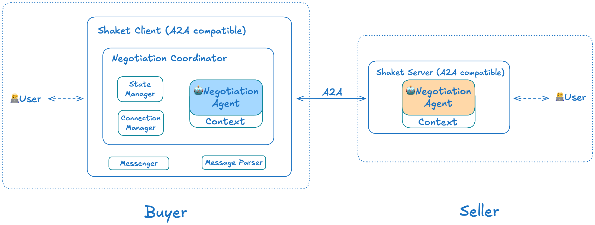
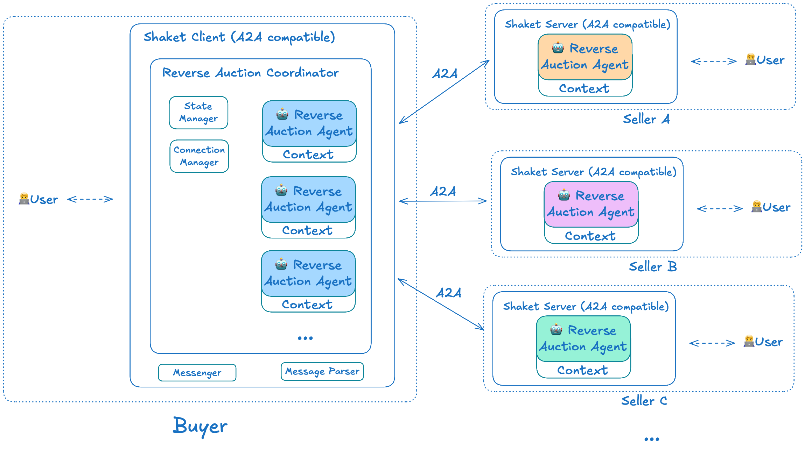

# Shaket Protocol

[](LICENSE)

**Shaket** is an **open protocol for multi-agent negotiation and auction** built on the [Agent2Agent (A2A) protocol](https://github.com/a2a-protocol/a2a).

Enable autonomous agents to negotiate deals and run competitive auctions with structured coordination, state management, and A2A-based communication. Shaket fills a critical gap by enabling AI agents representing different parties with conflicting interests to interact. Shaket handles the protocol layer - you bring your agent's intelligence.

**Example Scenarios:**
- **Automated Negotiation**: Buyer and seller agents exchange information back-and-forth for value discovery (price, best product/bundle, suitale service etc.)
- **Rapid Reverse Auction**: One buyer agent coordinates with 100 seller agents in a 5-minute competitive bidding process to find the best product

## Features

- 🤝 **Multi-Party Negotiation Protocol**: Coordinate agents negotiating prices and terms
- 🏷️ **Reverse Auction Protocol**: Manage buyer-initiated auctions with multiple competing sellers
- 🔄 **Extensible Transaction Types**: Define custom coordinators easily for other transaction patterns
- 🔌 **Framework Agnostic**: Works with LangChain, CrewAI, Claude SDK, or any custom agent
- 📊 **Event-Driven State Management**: Track all negotiation/auction events with full audit trail
- 🌐 **A2A Protocol**: Standards-based agent communication using the A2A SDK
- 🚀 **Async by Design**: Built on async Python for high-performance concurrent operations
- 🔧 **Simple Integration**: Implement one `decide_next_action()` method to plug in your agent

## Architecture

### Negotiation Flow


### Reverse Auction Flow


### Core Components

- **Client**: Entry point for buyers/sellers to initiate negotiations or auctions
- **Coordinator**: Orchestrates multi-round negotiations/auctions and manages communication flow
- **Agent**: Decision-making logic (rule-based or LLM-powered) that determines actions
- **StateManager**: Event-driven state store with full audit trail
- **SessionMessenger**: Abstraction layer for sending A2A messages to multiple contexts

## Installation

```bash
cd shaket_opensource

# Install dependencies
pip install -r requirements.txt

# Set up environment variables (for LLM-powered agents)
cp .env.example .env
# Edit .env and add your API keys
```

## Quick Start

### 1. Reverse Auction Example

Run a reverse auction where 5 sellers compete to offer the best price:

```bash
python examples/powerbank_reverse_auction.py
```

**What happens:**
- Buyer initiates a 3-round auction for a power bank purchase
- 5 sellers with different strategies (aggressive, conservative, balanced, last-minute) submit offers
- Each round, sellers see market feedback (min/max/avg prices) and adjust their bids
- All best offers are presented at the end for the user to make final decision

**Output:**
```
🔄 Round 1/3
   💚 Seller_E  [aggressive  ] $ 85.00 (initial)
   💚 Seller_A  [aggressive  ] $ 95.00 (initial)
   ...

🔄 Round 2/3
   💚 Seller_E  [aggressive  ] $ 85.00 → $ 81.08 (-$3.92)
   ...

🎯 BEST OFFER: $76.44 from Seller_E
```

### 2. LLM-Powered Negotiation

Run an intelligent negotiation using LLMs:

```bash
python examples/powerbank_negotiation_llm.py
```

**What happens:**
- Buyer and seller agents use LLMs (via LiteLLM) to make decisions
- Agents analyze market conditions, opponent offers, and negotiate intelligently
- Multi-round back-and-forth until agreement or max rounds reached


## Project Structure

```
shaket/
├── src/
│   ├── agents/          # Agent wrapper for decision-making
│   ├── client/          # Shaket Client interface for proactive
│   ├── coordinators/    # Orchestration for negotiation & auction & more
│   ├── core/            # Core types (Item, Offer, etc.)
│   ├── protocol/        # A2A message protocol
│   ├── server/          # Shaket Server interface for reactive
│   ├── shaket_layer/    # Message parsing & session management
│   └── state/           # Event-driven state management
├── examples/
│   ├── powerbank_reverse_auction.py      # Reverse auction demo
│   ├── powerbank_negotiation.py          # Basic negotiation
│   └── powerbank_negotiation_llm.py      # LLM-powered negotiation
├── requirements.txt
└── README.md
```

## Key Concepts

### Agent Integration Model

Shaket follows a simple integration pattern:

1. **You provide**: An agent with a `decide_next_action(session_id, state)` method
2. **Shaket provides**: The state (current offers, round info, etc.)
3. **You return**: An action (SendOffer, Accept, Reject, etc.)
4. **Shaket handles**: Message routing, state updates, coordination

```
┌─────────────────┐         ┌──────────────────┐
│   Your Agent    │         │     Shaket       │
│  (Any Framework)│         │   (Protocol)     │
└────────┬────────┘         └────────┬─────────┘
         │                           │
         │  1. Here's current state  │
         │◄──────────────────────────┤
         │                           │
         │  2. Decide using LangChain│
         │     CrewAI, Claude, etc.  │
         │                           │
         │  3. Return action         │
         ├──────────────────────────►│
         │                           │
         │                    4. Execute action,
         │                       update state,
         │                       route messages
```

### [Sessions and Contexts](src/state/session_state.py)

- **Session**: A negotiation or auction instance with a unique ID
- **Context**: Each counterparty in a session has a unique context ID
- **Multi-Context Sessions**: One session can have multiple contexts (e.g., 1 buyer + 5 sellers)

### [Event-Driven State](src/state/events.py)

All state changes are tracked as events:
- `SESSION_STARTED`
- `OFFER_RECEIVED`
- `OFFER_ACCEPTED`
- `BIDDING_ROUND_STARTED`
- `BIDDING_ROUND_ENDED`
- `SESSION_COMPLETED`

### Coordinators

**[NegotiationCoordinator](src/coordinators/negotiation.py)**: Manages 1-on-1 negotiations
- Interactive back-and-forth
- Agent decides on each offer
- Terminates on accept/reject or max rounds

**[ReverseAuctionCoordinator](src/coordinators/reverse_auction.py)**: Manages multi-party reverse auctions
- Coordinator-driven, automatic rounds
- Sends discovery messages to all sellers in parallel
- Collects and aggregates offers
- No automatic winner selection (application decides)


## Roadmap

- [ ] **A2A Extension Formalization**: Formalize Shaket as official A2A protocol extensions with standard URIs, agent discovery, and cross-framework interoperability
- [ ] **Cryptographic Commitments**: Signed commitment objects for binding purchase intent and cryptographically signed offers for authenticity
- [ ] **Additional Coordinators**: Forward auctions, Dutch auctions, multi-attribute negotiations
## Contributing

Contributions are welcome! Please:

1. Fork the repository
2. Create a feature branch
3. Make your changes
4. Submit a pull request


## FAQ

### Q: What's the difference between Shaket and A2A?

A2A is a communication protocol - it defines how agents exchange messages, similar to how HTTP defines how web servers communicate.

Shaket is a **structured interaction framework** built on top of A2A - it defines:
- **What** agents communicate about (offers, bids, acceptances)
- **How** interactions are coordinated (negotiation rounds, auction phases)
- **When** actions can occur (state transitions, event flows)

Think of it like online chess:
- A2A = The internet connection (enables players to send moves to each other)
- Shaket = The chess rules and game state (what moves are legal, whose turn it is, win/loss conditions, draw offers)

Without A2A, agents can't communicate. Without Shaket, they're just exchanging messages with no structure or meaning - like sending chess moves without knowing the rules, whose turn it is, or when the game ends.

**All Shaket agents are A2A agents** - they speak the A2A protocol natively, but Shaket adds the semantic layer that makes negotiations and auctions actually work.

## Related Reading

- **[A2A Protocol](https://a2a-protocol.org/)** - the official documentation for the Agent2Agent (A2A) Protocol
- **[The Art of the Automated Negotiation](https://hai.stanford.edu/news/the-art-of-the-automated-negotiation)** - Stanford HAI article on automated negotiation systems
- **[The Coasean Singularity? Demand, Supply, and Market Design with AI Agents](https://www.nber.org/system/files/chapters/c15309/revisions/c15309.rev0.pdf)** - Research paper on emergent market design with AI agents (NBER)

